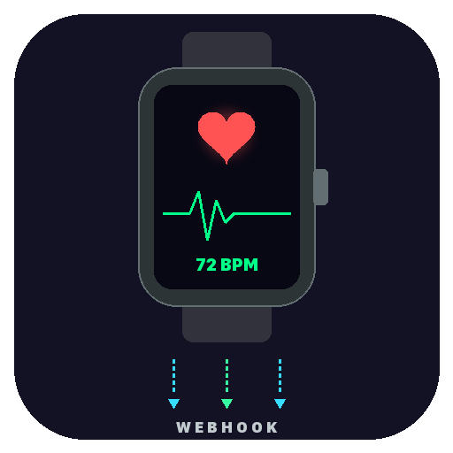

<p align="center">
  
</p>

# ⌚ Apple Health Webhook

> Vibe-coded with Claude — because manually checking health stats is so 2024.

A lightweight webhook relay that syncs your Apple Watch health data (heart rate, sleep, steps) to [OpenClaw](https://github.com/openclaw/openclaw) via iOS Shortcuts. Deployed on Railway, secured with API keys and rate limiting.

## How It Works

```
Apple Watch → iOS Shortcuts → Railway Webhook → OpenClaw → Morning Health Report
```

Your watch collects the data. A Shortcut fires it off. This server catches it, validates it, and forwards it to your AI agent for daily health summaries. Zero manual input.

## Features

- **API Key Auth** — no unauthorized data gets through
- **Rate Limiting** — 100 req/15min per IP
- **Request Logging** — full audit trail for debugging
- **Auto-Forward** — receives health payload, immediately relays to OpenClaw
- **Health Check** — `GET /` for uptime monitoring
- **One-Click Deploy** — Railway-ready with `railway.json`

## Quick Start

```bash
# Clone & install
git clone https://github.com/0x43e96f/apple-health-webhook.git
cd apple-health-webhook
npm install

# Configure
cp .env.example .env
# Edit .env with your API_KEY and OPENCLAW_WEBHOOK_URL

# Run
npm start
```

## API

### `POST /webhook/health`

Send health data with an API key:

```bash
curl -X POST http://localhost:8080/webhook/health \
  -H "Content-Type: application/json" \
  -H "X-API-Key: your-key" \
  -d '{"data": {"heartRate": 68, "sleepDuration": 7.5, "steps": 4500}, "trigger": "morning-report"}'
```

### `GET /` — Health check
### `GET /test` — Config status

## Deploy to Railway

1. Push to GitHub
2. Connect repo on [railway.app](https://railway.app)
3. Set env vars: `API_KEY`, `OPENCLAW_WEBHOOK_URL`
4. Done. Railway auto-detects Node.js.

Or use the deploy script: `./deploy-to-railway.sh`

## iOS Shortcut Setup

1. Create a new Shortcut
2. Add "Get Health Data" actions (heart rate, sleep, steps)
3. Add "Get Contents of URL" → point to your Railway URL
4. Set `X-API-Key` header
5. Schedule via Automations (e.g., every morning at 8am)

## Tech Stack

- **Runtime**: Node.js 18+
- **Framework**: Express
- **Security**: Helmet + CORS + rate-limit
- **HTTP Client**: Axios
- **Deploy**: Railway

## Built With

This entire project was vibe-coded with [Claude](https://claude.ai) — from architecture decisions to the actual code. The human provided the idea and the Apple Watch; Claude did the rest.

## License

MIT
